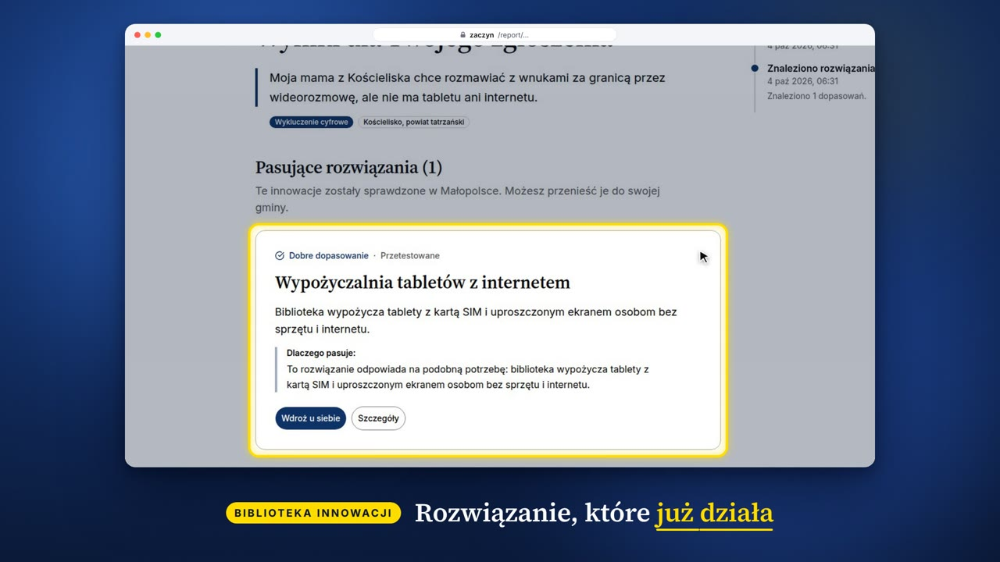

# Zaczyn: Małopolski Hub Innowacji Społecznych

Prototyp przygotowany na wyzwanie ROPS Kraków (HackYeah). Mieszkaniec opisuje problem społeczny własnymi słowami, a Zaczyn szuka sprawdzonych rozwiązań w Bibliotece Innowacji Społecznych. Jeśli żadne nie pasuje, zgłoszenie staje się otwartym wyzwaniem dla innowatorów z całej Małopolski. Działa wszystkie siedem modułów wyzwania.

Nazwa: zaczyn to zakwas, mała porcja, od której rośnie cały bochenek. Jedno sprawdzone rozwiązanie z jednej gminy może pomóc w wielu innych.

## Wideo (58 s)

[](docs/zaczyn-showcase.mp4)

Film powstał z prawdziwych nagrań z aplikacji.

## Co potrafi

**Mieszkaniec**

- Opisuje problem w jednym polu na stronie głównej, pisząc albo dyktując głosem.
- W trakcie pisania widzi podgląd podobnych rozwiązań z Biblioteki. Gmina jest rozpoznawana z tekstu, a wybór gminy ma wyszukiwarkę bez polskich znaków.
- Po wysłaniu dostaje dopasowane innowacje z wyjaśnieniem, dlaczego pasują, albo informację, że zgłoszenie trafiło do otwartego wyzwania.
- Widzi historię swojego zgłoszenia i to, czy podobny problem zgłoszono w innych gminach.
- Może testować nowe rozwiązania i oceniać je (Tester innowacji).

**Innowator (NGO, gmina, osoba prywatna)**

- Przegląda otwarte wyzwania z filtrami (obszar, powiat, wyszukiwanie) i mapę potrzeb Małopolski.
- Zgłasza pomysł jako fiszkę w czterech krokach, z listą kompletności.
- Rozwija pomysł z asystentem, który uzupełnia Kanwę Innowacji Społecznych.
- W trakcie naboru generuje wniosek grantowy na podstawie fiszki.
- Instytucja może przygotować plan wdrożenia wybranej innowacji (Middleman Innowacji).

**Ekspert**

- Widzi wszystkie pomysły i wątki, odpowiada autorom.
- Podsumowuje opinie z testów jako listę usprawnień.

**Zespół ROPS (administrator)**

- Skrzynka: pomysły z triażem AI i szkicami odpowiedzi, moderacja wstrzymanych zgłoszeń z podanym powodem, nieudane zadania w tle.
- Trendy tygodniowe według obszarów, edycja Biblioteki, ogłaszanie naborów.

**Dla wszystkich**

- Interfejs po polsku, angielsku i ukraińsku (`/en/…`, `/uk/…`). Opis po ukraińsku lub angielsku jest tłumaczony na polski przed wyszukiwaniem.
- Ułatwienia dostępu w stopce: wielkość tekstu do 150%, wysoki kontrast, tryb ciemny, tekst łatwy do czytania, czytanie na głos. Projektowane pod WCAG 2.1 AA.
- Bezpieczeństwo: dane osobowe usuwane przed wyszukiwaniem, moderacja wulgaryzmów, gróźb i treści, które nie opisują problemu, numery alarmowe przy opisie zagrożenia.

## Moduły wyzwania

| Moduł                                                                                 | Gdzie                                                      |
| ------------------------------------------------------------------------------------- | ---------------------------------------------------------- |
| I. Kojarzenie potrzeb z rozwiązaniami (obowiązkowy)                                   | `/`, `/report`, `/report/[id]`                             |
| II. Zasobnik wiedzy (mapa wyzwań, Biblioteka, materiały, trendy)                      | `/knowledge`, `/knowledge/library`, `/admin/trends`        |
| III. Kreator innowacji (fiszka, asystent, generator wniosku)                          | `/ideas/new`, `/ideas/[id]/assistant`, `/calls/[id]/apply` |
| IV. Tester innowacji                                                                  | `/tests`                                                   |
| V. Komunikacja (wątki, powiadomienia na żywo)                                         | `/messages`, strony pomysłów                               |
| VI. Panel ROPS (skrzynka z triażem AI i szkicami odpowiedzi, moderacja, CRUD, nabory) | `/admin`                                                   |
| VII. Middleman Innowacji (plan wdrożenia dla instytucji)                              | `/adapt/[slug]`                                            |

## Szybki start

Wymagania: Node 22, pnpm 10, Docker.

```sh
pnpm install
cp .env.example .env            # klucze API albo AI_MOCK=1 (patrz niżej)
pnpm es:dict                    # kopiuje polski słownik hunspell do obrazu Elasticsearch
docker compose up -d db es      # Postgres 16 + Elasticsearch 9 z analizą języka polskiego
pnpm db:migrate
pnpm db:seed                    # dane demonstracyjne, każde zgłoszenie przechodzi przez prawdziwy pipeline
pnpm dev                        # http://localhost:5173 (zadania w tle działają w tym samym procesie)
```

> `pnpm db:seed` czyści bazę (`TRUNCATE`) i usuwa indeksy Elasticsearch, zanim wgra dane od nowa. Nie uruchamiaj go na bazie z danymi, które chcesz zachować.

### Bez kluczy czy z kluczami?

- **Offline (`AI_MOCK=1`)**: aplikacja działa w całości bez dostępu do internetu. Modele są zastąpione prostymi regułami: klasyfikacja i ocena dopasowania opierają się na słowach, tytuły wyzwań to pierwsze zdanie zgłoszenia, wyjaśnienia „Dlaczego pasuje” są szablonowe. Wystarcza do sprawdzenia przepływów, nie do oceny jakości.
- **Z kluczami (`AI_MOCK=0`)**: prawdziwa klasyfikacja, ocena dopasowania i teksty. Do demo zalecane. Po zmianie trybu uruchom ponownie `pnpm db:seed`, żeby dane demonstracyjne przeszły przez prawdziwe modele.

| Zmienna             | Do czego                                                                                                                     | Bez niej                   |
| ------------------- | ---------------------------------------------------------------------------------------------------------------------------- | -------------------------- |
| `TYPESAFE_API_KEY`  | Decyzje Jev: klasyfikacja, moderacja, ocena dopasowania, potwierdzanie danych osobowych, triaż, kompletność fiszki           | reguły słownikowe          |
| `ANTHROPIC_API_KEY` | Claude: wyjaśnienia dopasowań, teksty wyzwań, asystent, wniosek grantowy, Middleman, tekst łatwy, tłumaczenia; zapas dla Jev | szablonowe teksty          |
| `VOYAGE_API_KEY`    | wielojęzyczne embeddingi do wyszukiwania wektorowego                                                                         | wektory z haszowanych słów |

`DECISION_PROVIDER` przełącza dostawcę decyzji (`jev` albo `claude`). Jakość dopasowania mierzy się tylko z prawdziwymi kluczami (`pnpm eval:match`).

## Konta demo

Logowanie na `/login`, jednym kliknięciem (produkcyjnie: login.gov.pl).

| Konto               | Rola                  | Co pokazać                                         |
| ------------------- | --------------------- | -------------------------------------------------- |
| Halina (mieszkanka) | mieszkanka            | zgłoszenie problemu, historia, testy               |
| Olena (mieszkanka)  | mieszkanka, ukraiński | zgłoszenie po ukraińsku                            |
| Ola (NGO)           | organizacja           | wyzwania, fiszka pomysłu, asystent, wniosek        |
| Piotr (gmina)       | samorząd              | wyzwania w gminie, plan wdrożenia                  |
| Dr Anna (ekspertka) | ekspertka             | odpowiedzi w wątkach pomysłów, podsumowanie testów |
| Marek (ekspert)     | ekspert               | jw.                                                |
| Zespół ROPS (admin) | administrator         | skrzynka, moderacja, trendy, Biblioteka, nabory    |

## Jak przetestować główne funkcje

1. **Zgłoszenie i dopasowanie.** Na stronie głównej kliknij przykład „Dojazd do lekarza” albo opisz problem własnymi słowami. Po chwili pojawi się podgląd „Podobne w Bibliotece”. Wyślij (przycisk ze strzałką albo Ctrl+Enter). Na stronie wyników zobaczysz postęp na żywo, potem dopasowane innowacje z wyjaśnieniem albo otwarte wyzwanie.
2. **Gmina.** Wpisz w opisie nazwę miejscowości (np. Bochnia): gmina uzupełni się sama. Albo otwórz wybór gminy i wpisz „nowy sacz”.
3. **Ochrona danych i moderacja.** Wpisz numer telefonu: pojawi się ostrzeżenie o danych osobowych. Wpisz groźbę lub wulgaryzm: pojawi się informacja o moderacji, a po wysłaniu zgłoszenie czeka na sprawdzenie zamiast tworzyć wyzwanie. Opisz zagrożenie życia: pojawią się numery 112, 116 123 i 116 111.
4. **Wdrożenie.** Przy dopasowanej innowacji kliknij „Wdroż u siebie”, wypełnij dane instytucji i wygeneruj plan (Middleman Innowacji).
5. **Mapa i wyzwania.** Na stronie głównej przewiń do mapy powiatów i kliknij powiat. Na `/challenges` wypróbuj wyszukiwanie, obszar, powiat i kolejność.
6. **Pomysł.** Zaloguj się jako Ola (NGO), otwórz wyzwanie, kliknij „Mam pomysł na rozwiązanie”. Wypełnij fiszkę i obserwuj listę kompletności. Potem „Rozwiń z asystentem”.
7. **Wniosek grantowy.** Menu, „Granty i nabory”, wybierz otwarty nabór i złóż wniosek: generator wypełni go na podstawie fiszki.
8. **Tester innowacji.** Menu, „Testuj nowe rozwiązania”, zapisz się na test i oceń rozwiązanie.
9. **Komunikacja.** Jako Dr Anna odpowiedz w wątku pomysłu Oli. Jako Ola zobacz odpowiedź i powiadomienie przy dzwonku.
10. **Panel ROPS.** Zaloguj się jako Zespół ROPS, Menu, „Panel ROPS”: skrzynka, zakładka Moderacja (zatwierdź albo odrzuć wstrzymane zgłoszenie), Trendy, Innowacje, Nabory.
11. **Dostępność i języki.** W stopce włącz 150%, wysoki kontrast, tekst łatwy, czytanie na głos. W nagłówku przełącz język na ukraiński. Przejdź stronę klawiszem Tab: pierwszy jest link „Przejdź do treści”.

## Jak działa dopasowanie

```
tekst zgłoszenia ──► usunięcie danych osobowych (regex + słownik imion, potwierdzane przez Jev)
                 ──► klasyfikacja Jev: obszar, grupy, pilność, gmina, „czy to problem”, „czy obraźliwe”
                 ├─► dane osobowe, wulgaryzmy, groźby lub nie-problem ─► moderacja ROPS (bez wyzwania)
                 ──► Elasticsearch: polskie BM25 (lematy hunspell) ‖ kNN na embeddingach Voyage
                 ──► Reciprocal Rank Fusion (k=60, w kodzie aplikacji)
                 ──► ocena Jev: Score 0–4 dla każdego kandydata, P(ocena ≥ 3) ≥ 0,6 = dopasowanie
                 ──► różnorodność MMR ─► Claude Haiku „dlaczego pasuje” ─► wyniki
                 └─► brak pewnego dopasowania ─► dołączenie do otwartego wyzwania albo nowe wyzwanie
```

Wszystkie progi (dopasowanie, moderacja, łączenie wyzwań) są w `POLICY` w `src/lib/server/match/policy.ts`. Moderacja wstrzymuje zgłoszenie przy każdym podejrzeniu: słownik wulgaryzmów i gróźb (`src/lib/server/entities/abuse.ts`) albo ocena modelu od 0,3. Zgłoszenie zatwierdzone przez ROPS nie jest wstrzymywane ponownie, chyba że zawiera nowe dane osobowe.

Szczegóły i uzasadnienie wyborów: [`docs/architektura.md`](docs/architektura.md). Koszty: [`docs/koszty.md`](docs/koszty.md).

## Struktura projektu

| Katalog                   | Zawartość                                                             |
| ------------------------- | --------------------------------------------------------------------- |
| `src/routes`              | strony i API (SvelteKit)                                              |
| `src/lib/components`      | komponenty interfejsu; `ui/` to komponenty shadcn-svelte              |
| `src/lib/server/match`    | pipeline zgłoszeń, polityka progów, wyzwania                          |
| `src/lib/server/search`   | Elasticsearch, wyszukiwanie hybrydowe, fuzja wyników                  |
| `src/lib/server/ai`       | Jev, Claude, embeddingi, prompty i ich wersje offline                 |
| `src/lib/server/entities` | dane osobowe, wulgaryzmy i groźby, rozpoznawanie miejscowości         |
| `src/lib/server/db`       | schemat bazy (Drizzle); migracje w `drizzle/`                         |
| `messages/`               | teksty interfejsu: `pl.json` (wzorzec), `en.json`, `uk.json`          |
| `scripts/`                | seed, ewaluacja, import TERYT, przebudowa indeksów, kształty powiatów |

## Skrypty

| Polecenie                                   | Co robi                                                                                                                     |
| ------------------------------------------- | --------------------------------------------------------------------------------------------------------------------------- |
| `pnpm check`                                | kompilacja tekstów (Paraglide) i sprawdzenie typów                                                                          |
| `pnpm check:messages`                       | każdy język ma wszystkie klucze z `pl.json`, z tymi samymi parametrami                                                      |
| `pnpm lint`                                 | Prettier i ESLint                                                                                                           |
| `pnpm vitest run`                           | testy jednostkowe (fuzja, polityka i moderacja, dane osobowe, wulgaryzmy, miejscowości, mapowanie, markdown)                |
| `pnpm test:e2e`                             | Playwright: przepływy i kontrola WCAG 2.1 AA (axe-core); wymaga zaseedowanej bazy; `PW_CHROMIUM_PATH` dla własnego Chromium |
| `pnpm eval:match`                           | hit@1, hit@3, MRR dla BM25, kNN, RRF, fuzji liniowej i RRF z oceną; precyzja i czułość wyzwań                               |
| `pnpm jev:smoke`                            | trafność obszaru Jev na 20 polskich zgłoszeniach (próg 80%)                                                                 |
| `pnpm db:generate` / `pnpm db:migrate`      | nowa migracja po zmianie schematu / zastosowanie migracji                                                                   |
| `pnpm worker`                               | zadania w tle jako osobny proces (na instancjach aplikacji ustaw `RUN_WORKERS_IN_APP=0`)                                    |
| `pnpm tsx scripts/es-reindex.ts all`        | przebudowa indeksów Elasticsearch z Postgresa bez przerwy w działaniu                                                       |
| `pnpm tsx scripts/import-teryt.ts TERC.csv` | import wszystkich 182 gmin Małopolski z oficjalnego pliku TERYT GUS                                                         |
| `pnpm tsx scripts/build-powiat-shapes.ts`   | generuje `src/lib/powiat-shapes.ts` (granice powiatów na mapę) z danych PRG GUGiK                                           |
| `k6 run scripts/load/intake.js`             | test obciążeniowy (aplikacja z `AI_MOCK=1`)                                                                                 |

## Produkcja

`docker compose --profile app up -d` uruchamia aplikację, osobny proces zadań, Postgresa i Elasticsearch z jednego obrazu (`Dockerfile`). Ustaw `ORIGIN` na publiczny adres. Dla Elastic Cloud wgraj słownik hunspell jako własny pakiet (`docker/elasticsearch/hunspell/pl_PL`).

## Dane

Wszystkie dane demonstracyjne są fikcyjne i nie zawierają prawdziwych danych osobowych.

- Kody TERYT powiatów są oficjalne, lista gmin to wybór demonstracyjny z zastępczymi kodami. Pełną listę wgrywa `scripts/import-teryt.ts`.
- Granice powiatów na mapie pochodzą z Państwowego Rejestru Granic (GUGiK), przez repozytorium ppatrzyk/polska-geojson.
- Biblioteka Innowacji jest fikcyjna. Do wdrożenia należy ją zastąpić eksportem Biblioteki ROPS (adapter w `scripts/seed.ts`).
